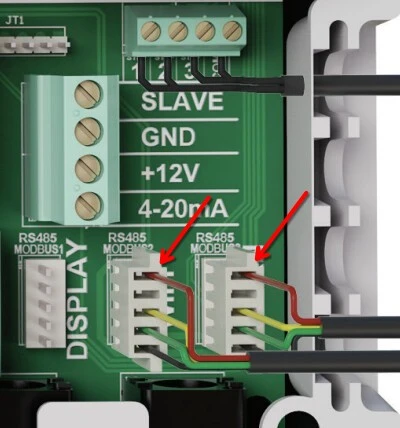

# Modbus Connection Guide

## Introduction

This guide explains how to connect a Modbus (RS485) reader/converter to your controller board. It is aimed at users who are not familiar with Modbus wiring and want to ensure a reliable and safe connection. The guide includes photos of the real hardware, wiring diagrams, a pinout table, and product recommendations for connectors.

## Required Parts

* **Controller board** (see photos below)
* **Modbus RS485 to Ethernet or USB converter** (photo included)
* **Standard 2.54 mm 5-pin PCB female connector** ([see example here](https://www.robotpark.com/2-54mm-5-Pin-PCB-Female-Connector)). Alternatively, you can use standard cables commonly used for Arduino wiring.
* Four-wire cable (suggested colors: red, yellow, green, black)

## Photos & Connection Overview

Below you will find photos of the relevant hardware components and connectors:

1. **Controller board** (with Modbus connector highlighted)

   
   

2. **Modbus RS485 Reader/Converter**

   

4. **Connector detail on controller (RS485 MODBUS3/EXTERN)**

   

## Wiring Table 

Below is the recommended wiring (top to bottom) between your controller and the RS485 converter. For communication, you need only two wires (A, B). In my wiring, there is also power supply for the Modbus gateway (Red and Black in the picture). **Always double-check your wire colors!** 

| Pin on Controller | Wire Color | Signal | Pin on RS485 Converter |
| ----------------- | ---------- | ------ | ---------------------- |
| 1 (Red)           | Red        | +12V   | DC+ / VCC              |
| 2 (n/a)           | n/a        |        | Not Connected          |
| 3 (Yellow)        | Yellow     | A      | A (RS485 A / D+)       |
| 4 (Green/Blue)    | Green/Blue | B      | B (RS485 B / D-)       |
| 5 (Black)         | Black      | GND    | GND / DC-              |

*Note: Your converter may also have a G (ground) and an additional shield connection, but only 4 wires are needed for basic RS485 operation.*

## Modbus Connectors
The NeoPool device acts as a Modbus **server** (formerly known as a *slave*), while this integration functions as a Modbus **client** (formerly known as a *master*).  
Only **one** Modbus client can be connected to a Modbus connector with the same label. It is not possible to operate multiple clients on connectors that share the same name.

Modbus connectors with **different labels** represent completely independent physical Modbus interfaces. Data traffic on one connector is **not visible** on the others.

There is one exception: the **DISPLAY** connector, which is present **twice** and is typically occupied by the built-in LCD.  
Since only one Modbus client can communicate with a Modbus server at a time, the DISPLAY connector is **not suitable** for this integration if the internal LCD is connected to either of the two DISPLAY ports.

## Set Up Your Modbus TCP Gateway

Below you will find screenshots of the relevant settings:

1. **Serial Settings**

   

2. **Network Settings**

    

## Adding to Home Assistant

You need to use the correct IP address of your Modbus TCP gateway and the port number that you set in the gateway's network settings.

For example, if your Modbus gateway's IP address is `192.168.1.50` and the port is `502`, use these values in your Home Assistant configuration.

## Example Products

* **2.54 mm 5-pin female connector:** [AliExpress search](https://www.aliexpress.com/wholesale?SearchText=2.54mm+5pin+female+connector)
* **RS485 to Ethernet converter:** [Amazon example](https://www.amazon.com/s?k=rs485+ethernet+converter) (I use [USR-DR164](https://www.pusr.com/products/Serial-to-Dual-Band-WiFi-Converter.html))
* **RS485 to USB converter:** [Amazon example](https://www.amazon.com/s?k=rs485+usb+converter)

## Tips & Troubleshooting

* **Check wire order carefully!** Reversed A/B wires are the most common cause of communication problems.
* **Use solid, clean connections** – avoid loose or oxidized wires.
* **Cable length:** For longer runs (>10 m), use shielded twisted pair cable for A/B signal wires.
* **Termination:** Some RS485 converters and boards require termination resistors at each end of the bus (usually 120 Ω). If you experience instability, try adding a resistor across A and B at both ends.
* **Power:** Double check that you do not exceed the voltage rating on your RS485 converter (typically DC 5–36 V).
* **Converter type:** Make sure your converter is set to RS485 mode, not RS232 or TTL.
* **Software:** Verify that your controller’s Modbus/RS485 port settings (19200 baud, 1 stop bit, no parity) match those configured on your reader/converter.
* **If nothing works:**

  * Swap A and B wires on the converter side (just in case labels differ).
  * Check for broken or poorly crimped connectors.
  * Try another cable or converter if available.
